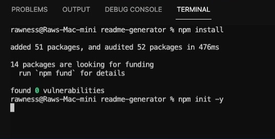
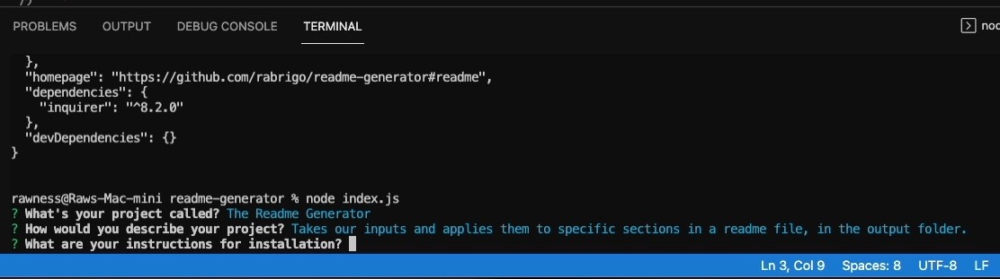
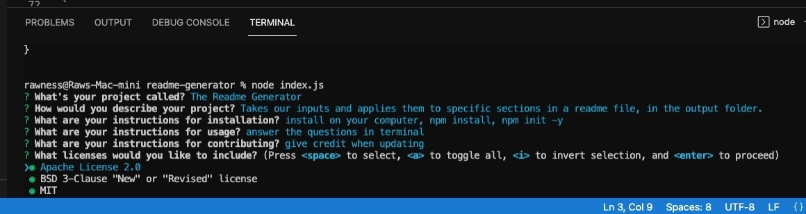

## About Readme Generator

This is a readme.md generator I developed with: JavaScript, Node.js, and file-system (npm). It will take user inputs for various sections and output them into a readme.md in the output folder. Each file will contain an .md file that includes a table of contents and sections for: Description, Installation, Usage, Contributing, License, and Contact.

Video demo link: 
https://vimeo.com/669675917/3cd01251ac

## Installation

Install Node onto your computer and then right click index.js, "Open in Integrated Terminal".

Then type in these commands: 
npm install
npm init -y

## Usage

Fill out respond to the questions to provide content to the respective sections. Leaving them blank will still allow you to proceed. 

To select one of the licenses to use in the template, just press space on any and then enter to proceed.

Proceeding all the way past the last question will generate a readme.md in the output folder. A table of contents will be included as well and redirect you to the specified section.

## Acknowledgements

A big thank you to user othneildrew. This generator is using their table of contents' format with some modifications: 

https://github.com/othneildrew/Best-README-Template
